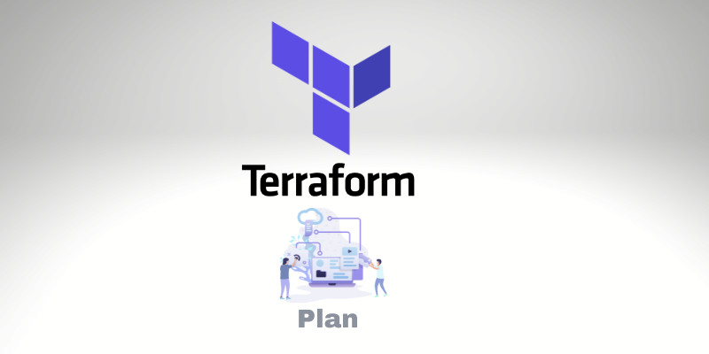
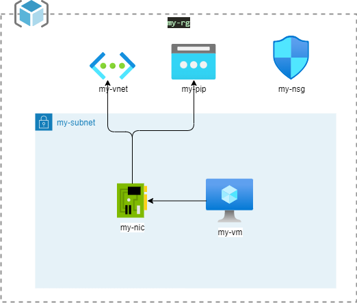
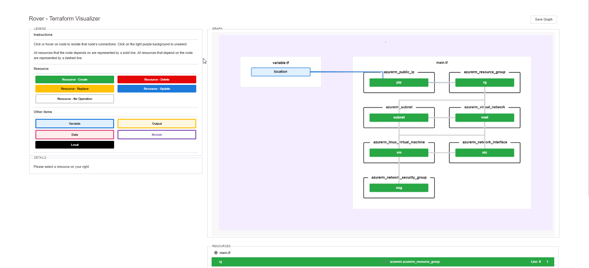

# Terraform Plan Visualizer



## Purpose of the project

This Github repository is based on the work of [Tu Nguyen](https://github.com/im2nguyen) around the visualization of the terraform plan. 

When you are in the real life and deploying large amount of resources in the cloud with terraform, it comes sometimes difficult to ensure that you plan is correct before applying it. 

The main idea of the project is to deliver a nice GUI to browse which will display changes that will be performed before constructing your plan.

This Repo presents how to integrate the tool in you CICD pipeline with github and access to your plan in a clean GUI interface that will be deployed on the nice [github pages interfaces](https://pages.github.com/).


## Terraform infrastructure used in that sample

The terraform code used in that project is located in the ```src``` folder. It's not the purpose to deploy here a complex terraform solution so the project here will deploy the infrastructure defined below:




Note that the deployment will use a remote backend stored in a cloud storage account on azure. You must configure that storage before running your pipeline as the tool used here will perform a terraform init and a plan for you before building your graphical plan.

## Requirements

### Devcontainer

The project is shipped with a dev container so you simply have to clone it and open the project in a dev container with vscode. To get more information on that please visit: [https://code.visualstudio.com/docs/devcontainers/containers](https://code.visualstudio.com/docs/devcontainers/containers)

### Create a storage account in your azure subscription

In your azure subscription create a storage account and a private blob storage that will be used to store your remote backend. Your will find the procedure here : [https://learn.microsoft.com/en-us/azure/storage/common/storage-account-create?tabs=azure-portal](https://learn.microsoft.com/en-us/azure/storage/common/storage-account-create?tabs=azure-portal)

### Create a service principal to deploy to azure

Create a service principal that will be used within your terraform init and plan phase. That service principal must have ```contributor``` role within your subscription.
The procedure to create that service principal is located here: [https://registry.terraform.io/providers/hashicorp/azurerm/latest/docs/guides/service_principal_client_secret](https://registry.terraform.io/providers/hashicorp/azurerm/latest/docs/guides/service_principal_client_secret)

In the pipeline, some variables will be set to automatically login to azure with terrafrom. Those environment variables are:

| environment variable | description                           |
| -------------------- | ------------------------------------- |
| ARM_CLIENT_SECRET    | your service principal client secret  |
| ARM_CLIENT_ID        | your service principal application id |
| ARM_TENANT_ID        | Your tenant id                        |
| ARM_SUBSCRIPTION_ID  | your subscription id                  |

### Configure GitHub secrets

Configure the following secrets in your github repository to set the necessary environment variables in the pipelines:

| Github Secret   | description                           |
| --------------- | ------------------------------------- |
| CLIENT_SECRET   | your service principal client secret  |
| CLIENT_ID       | your service principal application id |
| TENANT_ID       | Your tenant id                        |
| SUBSCRIPTION_ID | your subscription id                  |

You will find the information on how to create those secrets here : [https://docs.github.com/en/actions/security-guides/encrypted-secrets](https://docs.github.com/en/actions/security-guides/encrypted-secrets).


### Enable pipelines to perform the commit in your gh-pages

You need to authorize the pipelines to commit the result of the pipeline (which is a static website) to your github pages. To do so follow the guides [https://docs.github.com/en/repositories/managing-your-repositorys-settings-and-features/enabling-features-for-your-repository/managing-github-actions-settings-for-a-repository#configuring-the-default-github_token-permissions](https://docs.github.com/en/repositories/managing-your-repositorys-settings-and-features/enabling-features-for-your-repository/managing-github-actions-settings-for-a-repository#configuring-the-default-github_token-permissions)


### Update the backend.tfvars

Configure the file with your storage account information.

## How does it work

All the magic happen in the pipeline located in [.github/workflows/cicd.yaml](.github/workflows/cicd.yaml).

Here is the detail of each steps:

| name                                    | steps                                     | description                                                                               |
|-------------------------------------|---------------------------------------|---------------------------------------------------------------------------------------|
| checkout repo                           | actions/checkout@v3                       | checkout your repo                                                                        |
| make envfile                            | SpicyPizza/create-envfile@v1.3            | create an env file in the ./src/.env location that will be use by the rover docker image. |
| Terraform format                        | hashicorp/terraform-github-actions@master | ckeck the format of your terraform code                                                   |
| Generate terraform plan website         | addnab/docker-run-action@v3               | use the rove docker image to launch the web site build                                    |
| Unpack terraform plan vizualize website | montudor/action-zip@v1                    | unzip the rover.zip file that contain the website in a ./rover subdirectory               |
| deploy                                  | s0/git-publish-subdir-action@develop      | publish the subdirectory rover as a new branch (gh-pages) in the current repo             |

The main step is the ```Generate terraform plan website```. Basically it calls the rover docker images and:

1. mount the ./src folder in /src folder of the images
2. load the env file to set the necessary terraform environment variable in the context of the container
3. run the /bin/rover executable in the images with the necessary parameter. To get a full list of them please visit [https://github.com/im2nguyen/rover](https://github.com/im2nguyen/rover)

Note that your are able to configure the terraform.tfvars file and the backend.tfvars file quite easily.

## And the result is ...

Here is the result you get after the pipeline ran:



To see the website live please visit that website [https://matthieupetite.github.io/terraform-plan-visualizer-with-rover/](https://matthieupetite.github.io/terraform-plan-visualizer-with-rover/).

## To go further

The pipeline displayed here is quite simple and must be reworked to:

- integrate tagging and versionning
- integrate a manual validation set to then effectively run the apply phase of the terraform deployment
- Use a nicer way to integrate the website build by rover to integrate an history (for example use a subdirectory to get the list of each plan you have performed)
- ...

